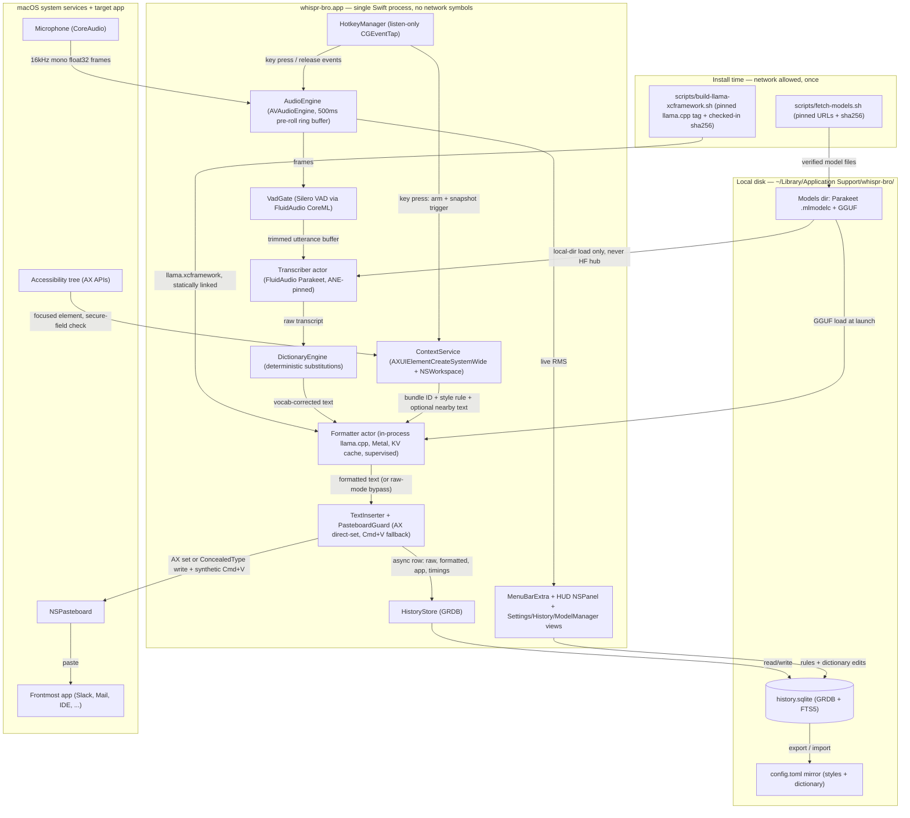
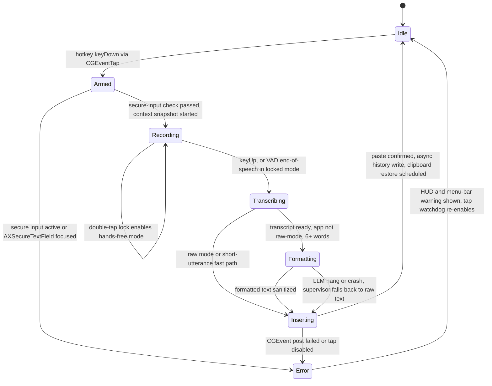

# whispr-bro — Architecture Spec (v1, canonical)

## 1. Overview

**whispr-bro** is a single-binary, fully native Swift 5.10 / SwiftUI menu-bar agent (`LSUIElement`) for macOS 14.4+ on Apple Silicon that clones Wispr Flow's two-stage dictation pipeline — push-to-talk speech → ASR → LLM "auto-edit" formatting → text inserted at the cursor of **any** app — entirely on-device: FluidAudio's CoreML Parakeet-tdt-0.6b-v2 transcribes on the Apple Neural Engine in ~190ms, an in-process llama.cpp (Metal, static xcframework, no server, no localhost port) reformats with a KV-cached system prompt and prompt-lookup speculative decoding, and the result lands at the cursor in ~480–650ms — at or under Wispr's ~700ms p99. The privacy stance is structural, not configurational: **zero networking code is compiled into the runtime binary** (verified by an `nm`/`otool` symbol audit in CI *and* a packet-capture behavioral test), all model downloads happen in an install-time script with pinned URLs + SHA-256, no telemetry exists, and all history/config lives in a local SQLite database plus a hand-editable TOML mirror. One process, one language, ~5–7k LOC of glue over four SwiftPM packages — buildable and maintainable by one developer.

## 2. System architecture



## 3. Dictation sequence

```mermaid
sequenceDiagram
    autonumber
    participant U as User
    participant HK as HotkeyManager
    participant AUD as AudioEngine
    participant CTX as ContextService
    participant ASR as Transcriber
    participant FMT as Formatter
    participant INS as TextInserter
    participant TGT as Target app
    participant DB as HistoryStore

    U->>HK: hold push-to-talk key (keyDown via CGEventTap)
    HK->>CTX: snapshot context (off critical path)
    CTX->>CTX: frontmost bundle ID + focused AX element
    Note over CTX: refuse if kAXSecureTextFieldSubrole or IsSecureEventInputEnabled()
    HK->>AUD: mark utterance start, splice 500ms pre-roll ring buffer
    AUD->>AUD: accumulate 16kHz mono; VAD trims silence; HUD shows waveform
    U->>HK: release key (keyUp) — or VAD auto-stop in locked mode
    Note over AUD: finalize buffer, ~5ms (in-memory, no I/O)
    AUD->>ASR: utterance buffer
    ASR->>ASR: Parakeet-tdt-0.6b-v2 on ANE
    Note over ASR: 190–250ms (verified 0.19s M4 benchmark)
    ASR->>FMT: raw transcript (after DictionaryEngine pass, under 1ms)
    alt raw mode OR under 6 words
        FMT->>INS: skip LLM — rule-based sentence-casing (0ms LLM)
    else formatting pass
        FMT->>FMT: KV-cached prefix + prompt-lookup decode, max_tokens = 2x input
        Note over FMT: ~50ms TTFT + 200–330ms generation
        FMT->>INS: sanitized formatted text
    end
    INS->>INS: save pasteboard, write text with org.nspasteboard.ConcealedType
    INS->>TGT: synthetic Cmd+V CGEvent (virtualKey 0x09 + maskCommand) — or AX direct-set fast path
    Note over INS,TGT: 30–60ms to visible text. TOTAL end-of-speech to inserted: ~480–650ms
    INS->>INS: restore pasteboard after ~2s (changeCount-checked)
    INS-)DB: async history row with per-stage latencies
```

## 4. Component table

| Component | Technology | Role | Wispr Flow equivalent |
|---|---|---|---|
| App shell | SwiftUI `MenuBarExtra`, `LSUIElement=true` | Menu-bar presence, settings/history/onboarding windows, status states | Wispr menu-bar app + web dashboard |
| HUD overlay | Borderless always-on-top transparent `NSPanel`, live RMS waveform | "Is it hearing me" feedback; makes secure-input refusal and context-read state visible | Wispr recording pill overlay |
| HotkeyManager | Listen-only `CGEventTap` (`.cgSessionEventTap`); KeyboardShortcuts for recorder UI | Global push-to-talk (hold, default Right Option/Fn) + double-tap lock; `IsSecureEventInputEnabled()` refusal | Wispr global hotkey |
| AudioEngine | `AVAudioEngine` tap → `AVAudioConverter` 16kHz mono; `Deque<Float>` ring buffer | Always-running capture, 500ms pre-roll so speech onset before keypress is never lost | Wispr streaming capture |
| VadGate | Silero VAD (FluidAudio CoreML `VadManager`) | Silence trim, hands-free auto-stop, idle ring-buffer gating | Wispr end-of-speech detection |
| Transcriber | FluidAudio `AsrManager`, Parakeet-tdt-0.6b-v2 CoreML, `.cpuAndNeuralEngine` | ASR stage 1: ~190ms final pass; incremental chunks for >10s holds | Wispr cloud ASR (<200ms budget) |
| Formatter | llama.cpp static xcframework, in-process C API, Metal, persistent KV cache, prompt-lookup decoding, supervised (auto-reinit on hang) | Stage 2 auto-edits: fillers, punctuation, per-app tone; skippable (raw mode + <6-word fast path) | Wispr cloud LLM auto-edits (<200ms budget) |
| DictionaryEngine | Pure Swift precompiled case-aware substitution table | Custom vocab guaranteed even when LLM is skipped; terms also injected into prompt | Wispr personal dictionary |
| ContextService | `AXUIElementCreateSystemWide` + `kAXFocusedUIElementAttribute`; `NSWorkspace.frontmostApplication` | App/context snapshot at key **press**; hard-refuses secure text fields | Wispr app-context awareness |
| TextInserter | AX direct-set (`AXUIElementSetAttributeValue`) fast path; `NSPasteboard` + `org.nspasteboard.ConcealedType` + Cmd+V `CGEvent` fallback; changeCount-guarded restore | Insert at cursor in any app; per-char typing explicitly avoided (non-viable on macOS) | Wispr text insertion |
| HistoryStore | GRDB.swift, SQLite + FTS5 at `~/Library/Application Support/whispr-bro/history.sqlite` | Searchable history with per-stage latencies shown in the UI; config source of truth | Wispr cloud history (local instead) |
| Config mirror | TOML export/import at `~/Library/Application Support/whispr-bro/config.toml` | Hand-editable, version-controllable styles + dictionary | — (whispr-bro extra) |
| ModelManager | Settings pane + `scripts/fetch-models.sh` | Lists installed models, verifies sha256 on disk, switches presets; all downloads install-time only | Wispr model routing (cloud) |

## 5. Latency budget table

| Stage | Target | Basis (benchmark) |
|---|---|---|
| Hotkey release → utterance finalize | ~5ms | Ring/utterance buffers already in memory (verified whisper-local recipe); no stream start, no file I/O |
| ASR final pass (Parakeet CoreML, ANE) | 190–250ms | Verified: FluidAudio Parakeet-tdt-0.6b-v2 ≈ 0.19s short utterance on M4 (~155x RTFx); incremental chunking keeps the final pass short for >10s dictations |
| Dictionary substitution | <1ms | Precompiled regex table over ~100 tokens, native Swift |
| Context snapshot | 0ms on critical path | Prefetched at key **press**, in parallel with speech |
| LLM prefill / TTFT | ~50ms | Static system prompt + per-app style block persistently KV-cached; only the transcript is newly prefilled (Metal prefill >1000 tok/s at 1B Q4) |
| LLM generation (~80–100 tokens, capped at 2× input) | 200–330ms | Llama-3.2-1B Q4_K_M ≈ 0.75GB weights; ~150–200 tok/s raw on ≥120GB/s unified memory; prompt-lookup speculative decoding (copy-heavy edit task) → 2–3x effective. **0ms** in raw mode / <6-word fast path |
| Insertion (pasteboard + Cmd+V CGEvent, or AX direct-set) | 30–60ms | Verified OpenWhispr/whisper-local recipe; dominated by target app's paste handling |
| **TOTAL end-of-speech → text inserted** | **~480–650ms (p99 ≤ ~700ms)** | Sum of above. **Wispr Flow p99: ~700ms** (200 ASR + 200 LLM + 200 network + overhead). whispr-bro deletes the network budget, which absorbs local inference being slower than hosted GPUs |

Per-stage timings are instrumented with `os_signpost`, written to every history row, **displayed in the history UI**, and regression-tested by `Tests/LatencyHarness` against fixture audio.

## 6. Model choices table

| Task | Model | Size/Quant | Runtime | Why |
|---|---|---|---|---|
| ASR (primary) | `parakeet-tdt-0.6b-v2` | 600M CoreML | FluidAudio, ANE-pinned (`.cpuAndNeuralEngine`) | Verified fastest: ~0.19s/short utterance on M4, 2.6x faster than runner-up (parakeet-mlx 0.50s); 2.37% WER; emits punctuation/casing natively, enabling the zero-LLM raw mode |
| ASR (fallback, user-selectable) | whisper.cpp `large-v3-turbo` CoreML | q5_0 | whisper.cpp | Multilingual + better WER (1.71% class) at ~1.23s — honest accuracy-vs-speed toggle; breaks the 700ms goal when selected |
| ASR (excluded) | faster-whisper | — | CTranslate2 | **Avoid**: no Metal/MPS, CPU-only on macOS, ~6.96s |
| LLM formatting (default, pending Phase 3 gate) | `Llama-3.2-1B-Instruct` | Q4_K_M GGUF (~0.75GB) | llama.cpp in-process, Metal | Only size class whose 100-token pass fits <300ms on **base** M chips; prompt-lookup speculation is ideal for copy-heavy edits |
| LLM formatting (quality preset, Pro/Max) | `Qwen3-1.7B` (thinking disabled) | Q4_K_M GGUF (~1.1GB) | llama.cpp in-process, Metal | ~200 tok/s raw on Pro/Max lands ~300ms with lookup decoding; better tone-matching |
| VAD | Silero VAD | CoreML | FluidAudio `VadManager` | Already a dependency; avoids vendoring TEN VAD C bindings |

All models load **strictly** from `~/Library/Application Support/whispr-bro/models/` — never auto-downloaded at runtime.

## 7. Privacy guarantees table

| Wispr Flow behavior | whispr-bro behavior | Enforcement mechanism |
|---|---|---|
| Audio streamed to cloud ASR | Audio never leaves process memory; buffer discarded after transcription | No `URLSession`/`Network.framework` symbols in the binary — verified by `scripts/audit-offline.sh` (`nm`/`otool`) in CI |
| Transcript sent to cloud LLM | llama.cpp statically linked **in-process** — no server, no localhost port, no IPC | By construction; no HTTP client compiled in |
| Cloud account, telemetry, analytics | None. No analytics SDK, no crash reporter, no auto-update | Zero network code; updates are manual rebuilds |
| Model/weights fetched at runtime | Install-time only: `fetch-models.sh` with pinned revisions + SHA-256 verify | FluidAudio pointed at local model dir; `DownloadUtils.enforceOffline = true` set before any FluidAudio model op, which makes every FluidAudio download path throw `OfflineError` instead of touching the network (FluidAudio does not read `HF_HUB_OFFLINE` — that env var applies to Python HF loaders only) |
| HF hub fallback download (phone-home gotcha) | Never triggered | Local-dir loading only; `enforceOffline` hard-block above |
| Behavioral offline claim asserted | Offline claim **proven** | One-time `tcpdump` packet capture of a full dictation cycle in Phase 7 acceptance + debug-build network tripwire (DYLD-interposed `connect()` shim that aborts on any outbound attempt) + documented Little Snitch/LuLu deny-all rule |
| Dictations in cloud history | SQLite + FTS5 on local disk only | GRDB, single local file; TOML mirror also local |
| Clipboard exposure during insertion | Clipboard managers ignore dictated text | Pasteboard write marked `org.nspasteboard.ConcealedType` (advisory) + changeCount-guarded 2s restore (real guarantee) |
| Password fields dictate-able | Hard refusal, visibly surfaced in HUD | `kAXSecureTextFieldSubrole` check + `IsSecureEventInputEnabled()` poll |
| Supply chain: closed SaaS | 4 SwiftPM packages (FluidAudio, GRDB, KeyboardShortcuts, swift-collections) + llama.cpp pinned tag | Checked-in SHA-256 for the llama.cpp tag/artifacts; tampered rebuild fails loudly |

## 8. macOS permissions table

| Permission | Why needed | What breaks without it |
|---|---|---|
| Microphone (`NSMicrophoneUsageDescription`) | `AVAudioEngine` input tap | No audio capture at all |
| Accessibility (`AXIsProcessTrustedWithOptions`) | AX focused-element/context reads **and** posting the synthetic Cmd+V `CGEvent`, and AX direct-set insertion | No text insertion, no context awareness, no secure-field detection — the app is inert |
| Input Monitoring | Listen-only `CGEventTap` for the global push-to-talk hotkey (Accessibility alone does not cover listen taps on macOS 10.15+) | Hotkey never fires; app can only be triggered from the menu bar |
| App Sandbox — **deliberately NOT used** | Sandboxed apps cannot use AX against other apps or post CGEvents | (Offline guarantee is enforced by compiling in zero network code instead — see §7) |
| Network entitlements — **none** | — | Nothing; the binary performs no network I/O by construction |

Onboarding walks through all three grants with live `AXIsProcessTrusted()` re-checks; a launch-time watchdog re-verifies grants (they can silently lapse when a re-signed binary replaces the app).

## 9. State machine



## 10. Repo layout

> **Implementation note (task-007):** the tree below shows the target-state
> layout. As built, the non-UI subsystems (Hotkey/, Audio/, ASR/, LLM/,
> Context/, Insertion/, Dictionary/, Store/, Support/) live in a separate
> library target `Sources/WhisprBroCore/` so `Tests/` can import them —
> SwiftPM executable targets are not importable by test targets. The app
> target `Sources/WhisprBro/` keeps the App/ views and pipeline glue, and the
> Xcode wrapper is replaced by `scripts/make-app.sh` producing
> `dist/WhisprBro.app` until code-signing needs grow.

```
whispr-bro/
├── Package.swift                     # SPM deps: FluidAudio, GRDB.swift, KeyboardShortcuts, swift-collections
├── WhisprBro.xcodeproj               # thin app-target wrapper (signing, entitlements, LSUIElement)
├── Sources/WhisprBro/
│   ├── App/
│   │   ├── WhisprBroApp.swift        # @main, MenuBarExtra scene
│   │   ├── MenuBarView.swift         # status icon states, quick toggles
│   │   ├── HUDPanel.swift            # borderless always-on-top NSPanel: waveform + pipeline state
│   │   ├── SettingsView.swift        # hotkey, engines, per-app styles, dictionary
│   │   ├── ModelManagerView.swift    # installed models, on-disk sha256 verify, preset switch
│   │   ├── HistoryView.swift         # FTS5 search + per-stage latency columns
│   │   └── OnboardingView.swift      # mic / Accessibility / Input Monitoring walkthrough
│   ├── Hotkey/HotkeyManager.swift    # listen-only CGEventTap, hold + double-tap-lock, secure-input check
│   ├── Audio/
│   │   ├── AudioEngine.swift         # AVAudioEngine tap, 16kHz mono, 500ms pre-roll Deque ring buffer
│   │   └── VadGate.swift             # Silero VAD, silence trim, auto-stop
│   ├── ASR/
│   │   ├── Transcriber.swift         # actor; AsrEngine protocol; incremental chunking >10s
│   │   ├── ParakeetEngine.swift      # FluidAudio AsrManager, ANE-pinned, local-dir only
│   │   └── WhisperFallbackEngine.swift
│   ├── LLM/
│   │   ├── Formatter.swift           # actor; raw-mode + <6-word fast-path logic; max_tokens = 2x input
│   │   ├── LlamaCppEngine.swift      # in-process C API, Metal, persistent KV cache, prompt-lookup decode
│   │   ├── EngineSupervisor.swift    # watchdog: detect hung llama_decode, teardown/rebuild, raw fallback
│   │   └── PromptBuilder.swift       # system prompt + style + dictionary + nearby-text assembly
│   ├── Context/
│   │   ├── ContextService.swift      # AX snapshot at key press, secure-field refusal
│   │   └── StyleRules.swift          # bundle-ID -> style (slack=casual, mail=formal, IDE=code)
│   ├── Insertion/
│   │   ├── TextInserter.swift        # AX direct-set fast path -> Cmd+V CGEvent fallback
│   │   └── PasteboardGuard.swift     # ConcealedType write, changeCount-checked 2s restore
│   ├── Dictionary/DictionaryEngine.swift
│   ├── Store/
│   │   ├── Database.swift            # GRDB, migrations, FTS5
│   │   ├── HistoryRepo.swift
│   │   ├── SettingsRepo.swift
│   │   └── ConfigMirror.swift        # TOML export/import of styles + dictionary
│   └── Support/
│       ├── Permissions.swift         # AXIsProcessTrusted, mic auth, grant-lapse watchdog
│       ├── Latency.swift             # os_signpost per-stage instrumentation
│       └── Log.swift                 # os.Logger, local only
├── Sources/whispr-bench/main.swift   # Phase 1 CLI spike + permanent bench harness (records, times stages)
├── Vendor/llama.xcframework          # built by script, pinned tag, gitignored binary
├── Models/                           # gitignored; populated by fetch-models.sh
├── scripts/
│   ├── fetch-models.sh               # install-time only: pinned revisions + sha256 verify
│   ├── build-llama-xcframework.sh    # pinned llama.cpp tag; artifact sha256 checked in
│   ├── audit-offline.sh              # nm/otool: fail CI if networking symbols exist in binary
│   ├── verify-offline-capture.sh     # tcpdump session over a full dictation cycle
│   └── net-tripwire.dylib            # debug-only DYLD interpose: abort on connect()
└── Tests/
    ├── DictionaryEngineTests.swift
    ├── PromptBuilderTests.swift
    ├── PasteboardGuardTests.swift
    └── LatencyHarness/               # end-to-end timing runs against fixture audio
```

## 11. Build milestones

1. **Walking skeleton (hotkey → ASR → paste, no LLM).** Starts with the day-1 throwaway CLI spike (`whispr-bench`): record on keypress, transcribe with FluidAudio Parakeet from the local model dir, print per-stage timings — validating the 0.19s ASR number and the mic TCC flow **on the actual machine** before any app code. Then: menu-bar shell, CGEventTap push-to-talk, AVAudioEngine capture with 500ms pre-roll, clipboard+Cmd+V insertion, permission onboarding. *Acceptance:* dictate into TextEdit, Slack, and a terminal; measured ASR ≤300ms on-device; pre-roll captures the first word when speaking starts before keypress; survives reboot. Parakeet's native punctuation already beats macOS dictation — daily-usable from here.
2. **Capture robustness + HUD.** Silero VAD trim/auto-stop, double-tap lock, secure-input detection with visible refusal, event-tap watchdog (`kCGEventTapDisabledByTimeout` re-enable), changeCount-safe pasteboard restore with `org.nspasteboard.ConcealedType`, AX direct-set insertion fast path, waveform HUD `NSPanel`. *Acceptance:* dictation refused with HUD warning in a password field; clipboard survives a user copy during the 2s window; tap self-recovers under synthetic load; HUD shows live RMS.
3. **Measurement gate + LLM stage.** **Hard gate:** build the bench harness *first*, measure the ~100-token formatting pass for Llama-3.2-1B Q4_K_M vs Qwen2.5-1.5B Q4 vs Qwen3-1.7B Q4 (no-think) on this machine, then freeze the default model from data. Then: in-process llama.cpp with persistent KV-cached prefix, prompt-lookup decoding, `max_tokens = 2×` transcript length, <6-word rule-based fast path, per-app raw mode, output sanitizer, EngineSupervisor (hung-decode teardown → raw fallback). *Acceptance:* p99 end-of-speech→inserted ≤700ms across the fixture set with LLM on; a deliberately hung decode falls back to raw text within 1s; no runaway generation exceeds the cap.
4. **Context awareness.** AX snapshot at key press, bundle-ID style rules (Slack casual / Mail formal / IDE code-aware presets, user-editable), optional nearby-text conditioning (default **off**), hardened password-field exclusion. *Acceptance:* same sentence formats differently in Slack vs Mail; context read verified as 0ms on critical path via signposts; secure-field tests pass against Safari, Chrome, and 1Password fields.
5. **Personal dictionary + config mirror.** Deterministic post-ASR substitution engine + dictionary injection into the prompt; settings editors; TOML export/import so styles and vocab are hand-editable and version-controllable. *Acceptance:* a custom proper noun survives both raw mode and LLM mode; round-trip TOML edit is reflected live.
6. **History.** GRDB + FTS5, async writes with per-stage latencies, searchable history window with copy/re-insert actions and **latency columns visible in the UI**. *Acceptance:* FTS search over 1k rows <50ms; a latency regression after a model swap is visible in normal use.
7. **Hardening + offline proof.** `fetch-models.sh` sha256 pinning, `audit-offline.sh` in CI, debug-build `connect()` tripwire, `verify-offline-capture.sh` tcpdump run, ModelManager pane with on-disk sha256 verify, idle-LLM-unload as a first-class setting (~1–2s reload), whisper.cpp fallback engine slot, Qwen3-1.7B quality preset, latency regression harness in CI. *Acceptance:* CI fails on any networking symbol; packet capture of a full dictation cycle shows **zero** packets from the process; LatencyHarness p99 within budget.

## 12. Key risks & mitigations

| Risk | Mitigation |
|---|---|
| Offline is by-construction, not OS-enforced (no sandbox possible due to AX/CGEvent needs) | Triple enforcement: static symbol audit in CI, behavioral tcpdump acceptance test, debug tripwire; documented Little Snitch/LuLu deny-all rule; `DownloadUtils.enforceOffline` defense-in-depth |
| LLM <300ms unproven on base M chips (the one soft number) | Phase 3 measurement gate decides the model from on-device data; prompt-lookup decoding; `max_tokens` cap; <6-word fast path; per-app raw mode (Parakeet punctuates natively) as a real product answer |
| Parakeet is English-only, 2.37% WER, no hotword biasing | Deterministic DictionaryEngine fixes vocab post-hoc; whisper.cpp large-v3-turbo fallback engine (honest UI toggle: breaks 700ms) |
| Clipboard-paste side effects (managers, terminals, secure input) | AX direct-set fast path; ConcealedType marker; changeCount-checked restore; `IsSecureEventInputEnabled()` visible refusal; per-app "leave in clipboard" override |
| llama.cpp C API churn / xcframework rebuilds | Pinned tag + checked-in artifact sha256; all calls isolated behind the engine-agnostic Formatter protocol; MLX-Swift documented as escape hatch |
| Event-tap fragility + TCC grant lapse after re-sign | Zero-work tap callback (enqueue only); watchdog re-enable; launch-time permission re-verification with guided re-grant |
| Hung/crashed llama context stalls the pipeline | EngineSupervisor: detect stuck `llama_decode`, teardown + rebuild context, fall back to raw insertion — never block a dictation |
| Memory ~2.5GB steady-state (Parakeet + 1B + KV) | First-class idle-unload setting for the LLM; acceptable on 16GB+ |
| Swift iteration speed for a solo dev | Every hard component is an SPM package or a verified recipe (VoiceInk = design reference only, GPL; OpenWhispr/whisper-local = MIT/portable); novel code is ~5–7k LOC of glue |

## 13. Open questions

1. **LLM model/quant for the <300ms 100-token pass** (Phase 3 gate decides; benchmark in this order): **Llama-3.2-1B-Instruct Q4_K_M** (bandwidth-fit favorite for base M chips), **Qwen2.5-1.5B-Instruct Q4_K_M** (better formatting quality, ~500ms worst case), **Qwen3-1.7B Q4_K_M with thinking disabled** (quality preset — only viable on Pro/Max bandwidth).
2. **Prompt-lookup (n-gram) speculative decoding via the in-process C API** — it lives in llama.cpp's examples, not core; verify availability at the pinned tag or budget a small port. If unavailable, the fallback plan is the raw decode numbers + fast paths, which still fit p99 on the 1B model.
3. **Streaming ASR during speech** (future optimization): run incremental Parakeet chunks *while the key is held* so the final pass covers only the tail — already specified for >10s utterances; extending it to all utterances could cut the 190–250ms ASR line to near-zero perceived latency. Deferred until Phase 3 numbers show it's needed.
4. **AX direct-set coverage**: what fraction of real targets (Electron apps, browsers, terminals) accept `AXUIElementSetAttributeValue` on `kAXSelectedTextAttribute`? Measure during Phase 2; determines how often the clipboard path (and its side effects) is exercised.
